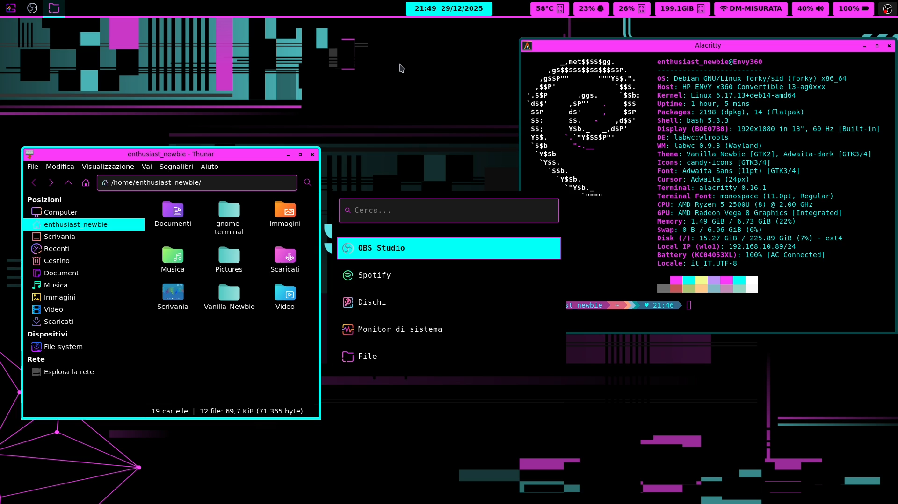

# 🌑 Vanilla_Newbie Theme

Benvenuti nel repository ufficiale di **Vanilla_Newbie**, un ambiente desktop minimale, basato su **LabWC** (Wayland). 

Questo setup è creato appositamente per chi ama il **Total Black** con forti accenti **Magenta Neon** e **Ciano**. Se sei un Nebwbie di Linux,come me, non preoccuparti: questa guida ti accompagnerà passo dopo passo.



---

## 🎨 Caratteristiche del Tema
* **Sfondo:** Nero Assoluto (#000000) per il massimo riposo degli occhi.
* **Bordi Finestre:** Ciano Neon (#00FFF7) con effetto cornice marcato.
* **Barre del Titolo:** Magenta Neon (#FA39FA) con testo nero per un contrasto perfetto.
* **Coerenza:** Lo stile è applicato a Terminale, Cartelle (GTK 3 e 4), Barra di sistema e Launcher.

---

## 🛠️ 1. Requisiti (Cosa installare prima)
Prima di applicare il tema, assicurati di aver installato i componenti necessari sul tuo sistema.

**Su Debian/Ubuntu e derivate:**
```bash
sudo apt update
sudo apt install labwc waybar wofi alacritty thunar swaybg grim fonts-jetbrains-mono
```


---

## 2.1 INSTALLAZIONE Tramite Script (opzione A)
Questa è la via più semplice. Lo script si occuperà di creare le cartelle, copiare i file e impostare i permessi corretti al posto tuo.

1.  **Scarica il progetto:**
    ```bash
    git clone [https://github.com/EnthusiastNewbie/Vanilla_Newbie.git](https://github.com/EnthusiastNewbie/Vanilla_Newbie.git)
    cd Vanilla_Newbie
    ```
2.  **Rendi lo script eseguibile:**
    ```bash
    chmod +x install.sh
    ```
3.  **Avvia l'installazione:**
    ```bash
    ./install.sh
    ```
4.  **Riavvia LabWC** o esegui il Logout.
    ```bash
    labwc -r
    ```

---

## 2.2 INSTALLAZIONE Manuale (opzione B)

### Passo 1: Creazione delle cartelle
```bash
mkdir -p ~/.config/{labwc,waybar,wofi,alacritty,gtk-3.0,gtk-4.0}
mkdir -p ~/.local/share/themes/Vanilla_Newbie/openbox-3
mkdir -p ~/Pictures
```

### Passo 2: Copia dei file

Entra nella cartella `Vanilla_Newbie` che hai scaricato  `cd Vanilla_Newbie` e lancia i seguenti comandi:
```bash
cp -r labwc/* ~/.config/labwc/
cp -r waybar/* ~/.config/waybar/
cp -r wofi/* ~/.config/wofi/
cp alacritty/alacritty.toml ~/.config/alacritty/
cp gtk/gtk.css ~/.config/gtk-3.0/
cp gtk/gtk.css ~/.config/gtk-4.0/
cp openbox/openbox-3/themerc ~/.local/share/themes/Vanilla_Newbie/openbox-3/
cp wallpaper.png ~/Pictures/vanilla_wallpaper.png
```

### Passo 3: Permessi degli script
```bash
chmod +x ~/.config/labwc/autostart
chmod +x ~/.config/labwc/scripts/*.sh
```

---

## 3. 📂 Struttura della Repository
Ecco come sono organizzati i file per mantenere il sistema pulito e modulare:

* `./alacritty`: Configurazione del terminale.
* `./firefox`: Risorse di personalizzazione e manifest.
* `./gtk`: File `gtk.css` universale per GTK3 e GTK4 (Nero + Bordi Neon).
* `./labwc`: Configurazione del Wayland Compositor (Autostart, Menu, Scripts).
* `./openbox`: File di compatibilità per sessioni X11.
* `./waybar`: La barra di stato superiore, rifinita in CSS.
* `./wofi`: Launcher applicazioni con trasparenze e bordi arrotondati.
* `./install.sh`: Script di installazione automatizzata.

## 4. ⌨️  Scorciatoie da Tastiera (Keybindings)
Una volta avviato LabWC, ecco i tasti principali per muoverti nel desktop:

| Tasto | Azione |
| :--- | :--- |
| **Super** (Tasto Windows) | Apre il menu delle applicazioni (Wofi) |
| **Ctrl + Alt + T** | Apre il Terminale (Alacritty) |
| **Super + E** | Apre il File Manager (Thunar) |
| **Alt + F4** | Chiude la finestra corrente |
| **Super + Q** | Chiude la finestra corrente (alternativo) |
| **Alt + Tab** | Passa tra le finestre aperte |
| **Print** | Screenshot (salvato in ~/Pictures) |
| **Ctrl + Alt + Canc** | Esce da LabWC |

---
## 5. Firefox: 
Per una coerenza estetica  tra tema del sistema e browser, ho pubblicato un estensione ufficiale per questo tema:

👉 **[Scarica l'estensione Vanilla_Newbie per Firefox](https://addons.mozilla.org/it/firefox/addon/vanilla_newbie/)**

L'estensione sincronizza i colori della barra degli strumenti e delle schede con il resto del tuo desktop.

---

## 💡 Tip
Per garantire che tutte le applicazioni utilizzino il tema scuro correttamente, lancia questo comando:
```bash
gsettings set org.gnome.desktop.interface gtk-theme 'Adwaita-dark'
```

---

##  Enthusiast_Newbie
Segui i miei esperimenti e fallimenti:
* **YouTube:** [@enthusiastnewbie](https://youtube.com/@enthusiastnewbie)
* **Sito Web:** [enthusiastnewbie.com](https://enthusiastnewbie.com)


